이 글은 vuepress와 Zeit(현, Vercel)을 사용하여 블로그를 쉽게 생성(서브) 할 수 있도록, 가급적 상세하게 다룰 예정이다.

## Motivation

본격 개발업무를 시작하기 이전에, 데이터 분석을 위한 블로그를 Jekyll + Github Page로 운영하였었다.
그러다가 Vue.js를 접하고 Zeit(현재, Vercel로 이름을 변경)을 사용하여 회사의 Dapp을 서비스하였다.

그 와중에 많은 프로젝트들의 기술문서들이 Vuepress로 작성됨을 알게 되면서, 블로그로 한번 써보고자 하였다.
그리고 Github Repository에 커밋만으로 랜더링을 해주는 Vercel를 사용함으로써 보다 편하게 할 수 있다.

## Pre-requisition

시작하기 앞서 세 가지 정도를 미리 준비해야 한다.

- Github Account
- Nodejs 
- Git

일단 github 계정을 만들고 다음단계로 진행한다.

NodeJS 설치는 아래 링크를 통해 진행한다.

- MacOS : https://nodejs.org/en/download/package-manager/#macos
- Windows : https://nodejs.org/en/download/package-manager/#windows

## Start Project

### Create repository on Github

Github 로그인하면, 우측 상단에 + 표시를 눌러 "New Repository"를 선택한다.

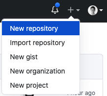

새로운 프로젝트를 아래와 같이 설정해 준다.

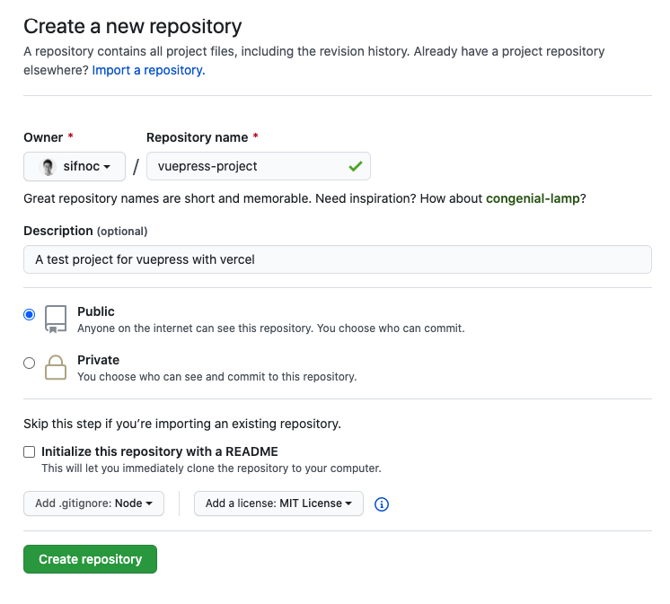

### Clone The Repository

Github에서 생성한 프로젝트의 저장소(Repository)를 로컬 개발환경으로 가져온다.

터미널 내에서 아래 명령어를 통해 저장소를 복제한다.

```bash
$ git clone https://github.com/sifnoc/vuepress-project
```

### Install Vuepress

NodeJS가 설치되어 있다면, 아래 명령어를 통해 vuepress 관련 모듈을 설치할 수 있다.

복제한 저장소내에로 이동하여 `vuepress` 모듈을 설치한다.

```bash
$ cd vuepress-project
vuepress-project $ yarn add vuepress -D
```

설치가 완료되면 `package.json` 파일에 `scripts` 부분을 아래과 같이 추가해준다.

```js
{
 "scripts": {
         "dev": "vuepress dev",
         "build": "vuepress build"
 },
  "devDependencies": {
    "vuepress": "^1.5.2"
  }
}

```

### Create First Page

VuePress는 `/` Root 디렉토리 외에 `post`, `docs` 등 사용자가 원하는 디렉토리에 위치한 MarkDown 문서를 웹페이지로 랜더링 할 수 있다. 이는 `.vuepress` 디렉토리를 생성하고 `config.js` 을 생성하여 조정할 수있다. `config.js` 사용한 vuepress 설정 방법은 다음글에서 다루도록 하겠다. 
먼저, 루트 디렉토리에 MarkDown 문서를 작성하고 vercel 에서 간단하게 랜더링 해볼 수 있도록 해보자.

아래 명령어로 `README.md` 파일을 작성한다.

``` 
vuepress-project $ echo "# This is My First Page on Vuepress" > README.md
```

vercel 설정을 들어가기 앞서, 로컬 환경에서 랜더링 해보도록 하자.

```bash
vuepress-project $ yarn dev

...
wait Extracting site metadata...
tip Apply theme @vuepress/theme-default ...
tip Apply plugin container (i.e. "vuepress-plugin-container") ...
tip Apply plugin @vuepress/register-components (i.e. "@vuepress/plugin-register-components") ...
tip Apply plugin @vuepress/active-header-links (i.e. "@vuepress/plugin-active-header-links") ...
tip Apply plugin @vuepress/search (i.e. "@vuepress/plugin-search") ...
tip Apply plugin @vuepress/nprogress (i.e. "@vuepress/plugin-nprogress") ...
...

success [00:14:20] Build d875c4 finished in 239 ms! ( http://localhost:8080/ ) 
```

웹브라우저를 열어 `http://localhost:8080` 주소로 접속하였을때, "This is My First Page on Vuepress" 문서가 나오면 성공이다.

### Commit Markdown File

`README.md` 파일을 포함하여, 지금까지 로컬환경에서 생성한 파일을  Github 저장소에 올라가도록 파일을 커밋한다.

```bash
vuepress-project $ git add .
vuepress-project $ git commit -m "Initial Commit"                
[master 75a5b35] Initial Commit
 3 files changed, 7769 insertions(+)
 create mode 100644 README.md
 create mode 100644 package.json
 create mode 100644 yarn.lock
vuepress-project $ git push origin master
...
 To https://github.com/sifnoc/vuepress-project
   a81ee64..75a5b35  master -> master
```

다시 웹브라우저를 켜서 Github 저장소 페이지를 가보면 아래와 같이 3개의 파일이 추가되어 있음을 확인할 수 있다.

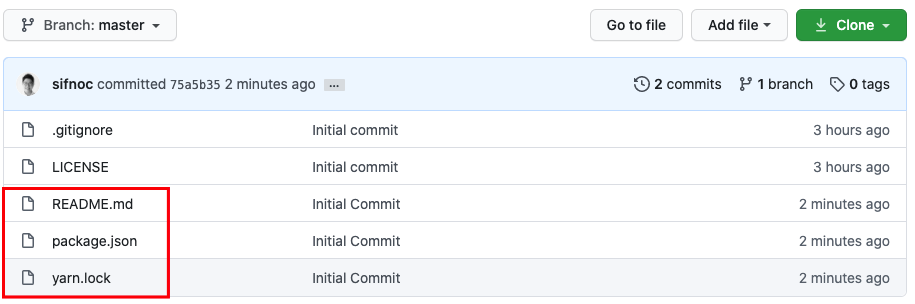

## Setup Vercel for Vuepress

[Vercel.com](https://vercel.com/) 에 접속하여 우측 상단 `Sign Up` 선택하고, 가급적이면 Github Account로 회원가입을 한다.

회원가입 이후, Github을 통해 로그인하게 되면 Dashboard를 볼 수 있다.

### Import Project

DashBoard 화면에서 `Impoert Project` 를 선택한다.

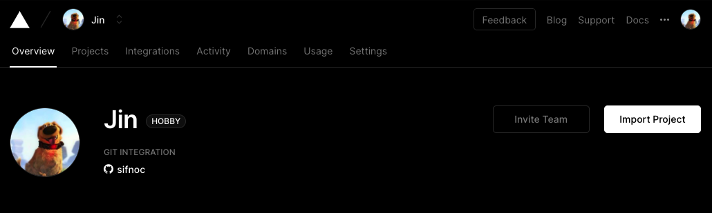

다음 이어지는 화면에서 `Import Git Repository` 아래 `Continue`를 선택한다.

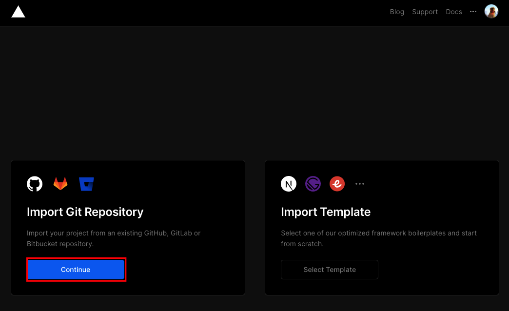

자신의 Github 계정에서 생성한 Project의 주소를 입력한다. 이 부분은 로컬환경에 복제한 Github 저장소 주소와 동일하다.

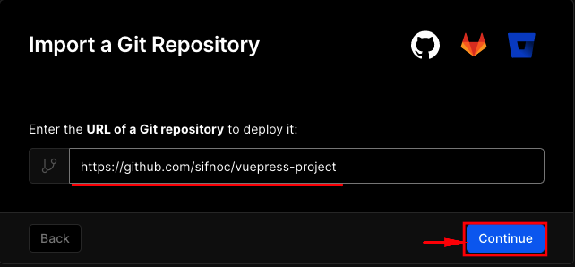

주소를 정확하게 입력하였다면, Github 페이지에서 보던 파일 이름들이 보인다.

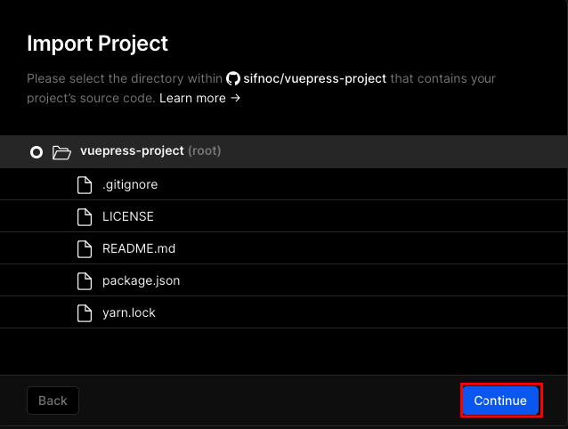

다음은,  `vercel`에서 MarkDown 페이지를 `vuepress`가 랜더링 할 수 있도록 아래와 같이 설정해준다.

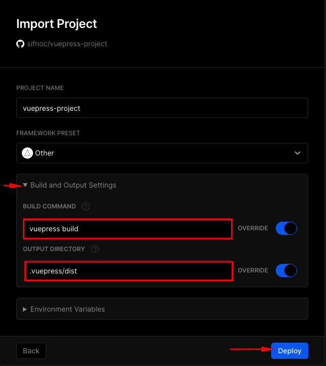

`.vuepress/dist` 는 `vuepress`가 기본적으로 랜더링한 웹페이지들을 두는 장소이다.

Github 저장소를 Vercel에서 성공적으로 로딩하면 곧바로 랜더링을 시작한다.

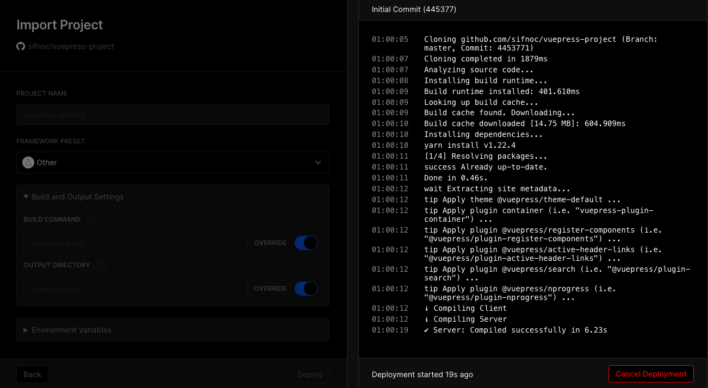

랜더링이 완료되면 결과 화면을 볼 수 있는 링크가 뜬다.

### Setup Webhook

`Vercel`의 웹훅 엔드포인트를 사용하여 Github 저장소의 특정 브랜치에서 커밋 또는 머지가 발생하는 경우 자동적으로 랜더링하여 업데이트 할 수 있다.

정적페이지 랜더링 부분을 `Vercel`에 완전히 맡기도록 Github에 Webhook을 걸어 특정 브랜치의 커밋때마다 페이지를 새로 업데이트 하도록 설정한다.

Vercel 대시보드로 돌아가서 `vuepress-project`를 선택하고, Settings -> Git Intergration 하단 메뉴를 보면 `Deploy Hook` 가 있다. 여기서 hook의 이름과 브랜치(여기서는 master 브랜치만 있다.)이름을 입력하고 `Create Hook` 버튼을 입력하면 `https://api.vercel.com/v1 ...`으로 시작하는 주소가 생성된다 해당 주소 오른쪽에 `Copy` 버튼을 클릭하여 클립보드에 해당 주소를 저장한다. 

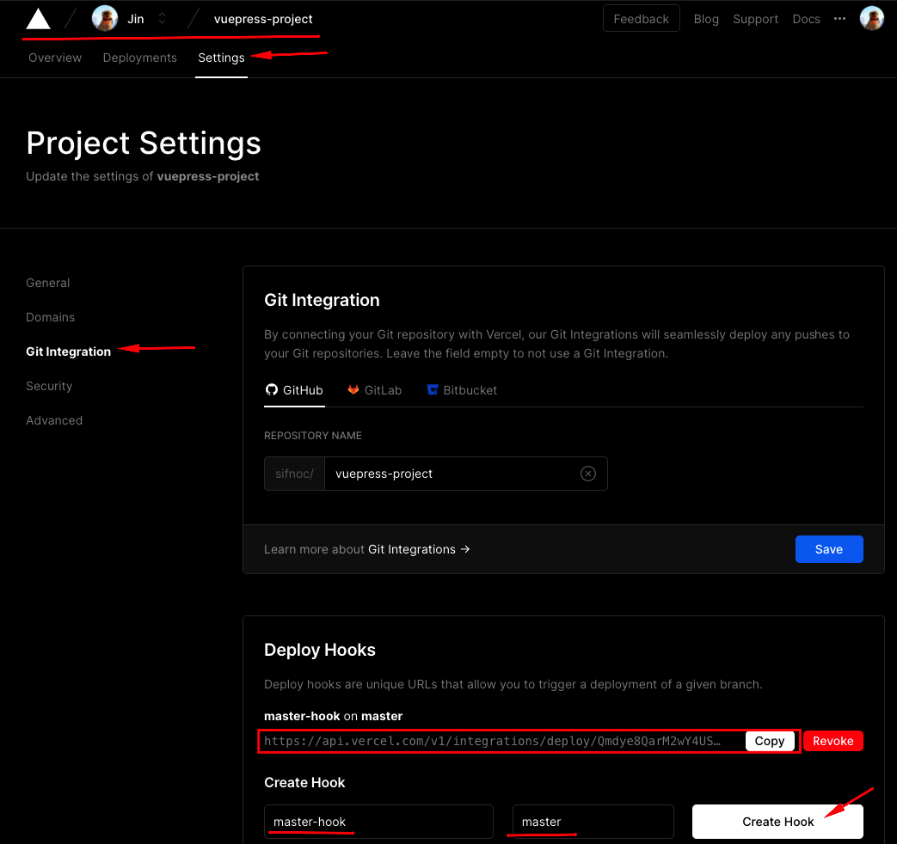

그리고 Github의 해당 프로젝트 페이지로 돌아가보자.

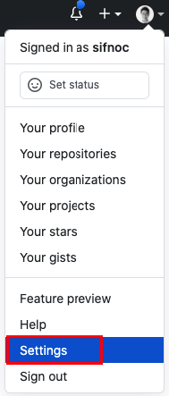

상단 메뉴에 `Settings` 탭을 클릭하고 좌측 메뉴중 `Webhooks`를 선택하면, 해당 저장소에 설정되어 있는 Webhook 리스트가 나온다. 이저장소에는 webhook을 설정한 적이 없기 때문에 비어있는 상태로 우측에 `Add Webhook` 버튼만 존재한다. 해당 버튼을 클릭하여  `Vercel` 에서 생성한 주소를 넣을 수 설정화면으로 들어간다.

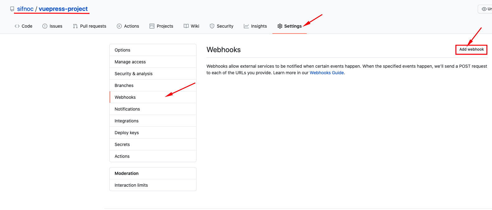

`Vercel`에서 생성한 Webhook URL 주소를 아래와 같이 입력한다. 이외 입력은 기본값으로 정한다. 이제 해당 Github 저장소에서 발생하는 모든 이벤트는 `Vercel`의 Webhook URL로 전달된다.

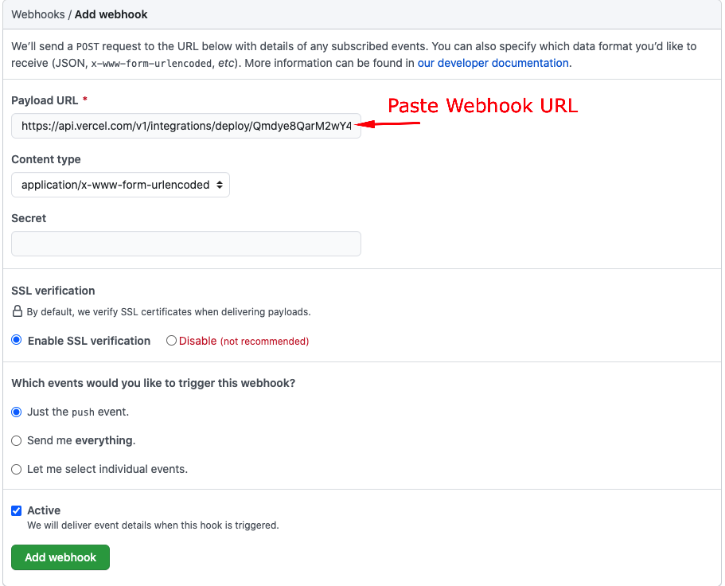

아래 화면처럼 Webhook URL 앞에 체크표시가 나타나면 정상적으로 등록된 것이다.

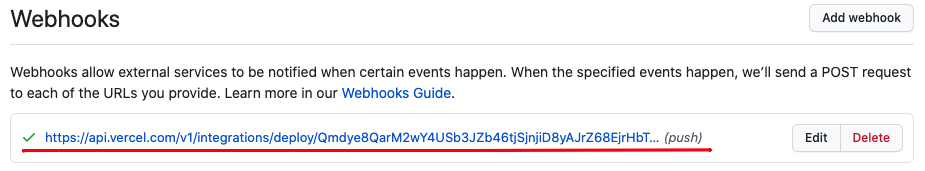

### Test Webhook

Webhook이 정상적으로 작동하는지 확인하기 위해 `README.md` 문서에 본문을 추가하고 `master` 브랜치에 커밋하여 보자.

```bash
vuepress-project $ echo "Master Branch Commit Text" >> README.md
vuepress-project $ git add README.md
vuepress-project $ git commit -m "Updated README"
vuepress-projetc $ git push origin master
...
4453771..5461f01  master -> master
```

이어지는 `Vercel`의 Dashboard 화면에 해당 커밋에 해당하는 페이지가 생성됨을 볼 수 있다.

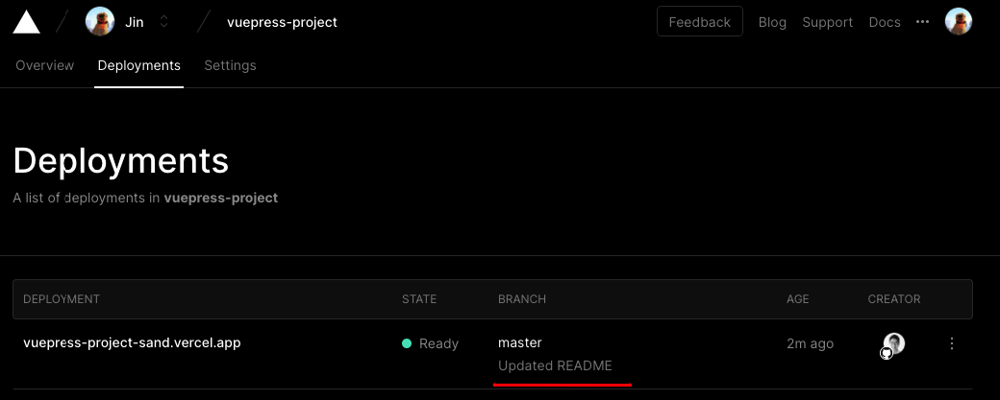

## Next

`Vuepress`와 `Vercel`를 사용하여 Github 저장소에 커밋만으로 블로그를 서비스 할 수 있도록 구성하였다. 다음글에서는 `Vuepress`에서 제공하는 블로그용 `Plugin`들을 사용하여 보다 블로그다운 웹페이지를 설정하는 방법에 대해 다루도록 하겠다.


## References
- [Vercel - Creating and Deploying a VuePress App with Vercel](https://vercel.com/guides/deploying-vuepress-to-vercel?query=vuepress#step-1:-getting-started-with-vuepress)
- [Vercel - Deploy Hooks](https://vercel.com/docs/v2/more/deploy-hooks)
